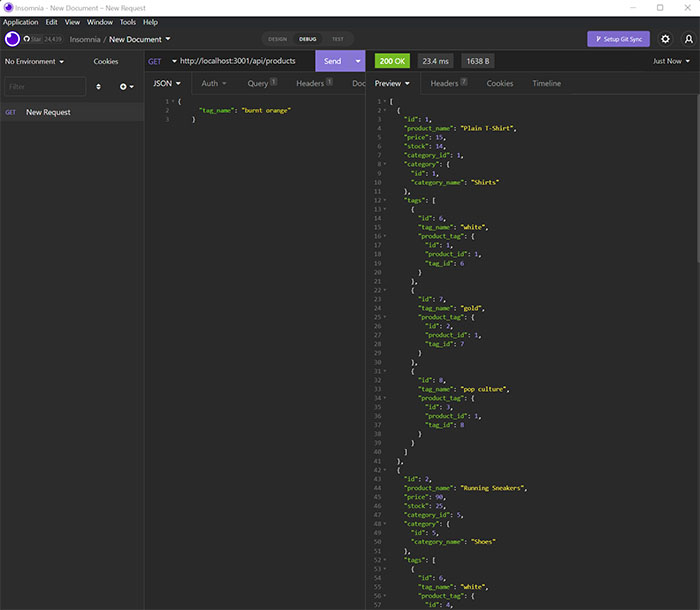

# E-commerce-back-end-development
A project to build out the back-end of a fictional e-commerce platform

## The 13th challenge in the UT-Austin Full Stack Development Bootcamp - Create the backend database management for an e-commerce company

___

We're pushing ahead with our work in backend systems and now we're adding tools like [Sequelize](https://www.npmjs.com/package/sequelize) into the mix. Sequelize makes the interface with the SQL database more straightforward that having to script out queries from scratch. There's still quite a bit under the hood but it overall makes the process significantly easier. 

We're also taking time to refine all of our apps by using environment variables and the [dotenv](https://www.npmjs.com/package/dotenv) module as well as further separating concerns as we get ready to dive deep into full MVC coding. 

To test the API, we used [Insomnia](https://insomnia.rest/). Once again, since this isn't a deployed application you can watch a video here that shows how it works. (Please forgive the occassional stumbles where I forgot to change my action or route in Insomnia)

[Video walkthrough of the E-Commerce backend application](https://drive.google.com/file/d/1yh3a2dgRaD6BTuBSUSy9S0DHvlO__W-6/view)

___

## How to use

At the root level, you'll start up your server by calling server.js. That will automatically sync sequelize with the SQL database on the backend.

You have 3 main endpoints for the API you can call on...

    - Products = localhost:3001/api/products
    - Categories = localhost:3001/api/catgeories
    - Tags = localhost:3001/api/tags

Each one of those endpoints will get you all of those items in the database.

If you want to add an item at any of those endpoints, simply change to a POST request.

Any edits or deletions to existing items require the corresponding ID number and a change to either a PUT or DELETE request. For example, to delete a product, the endpoint would be `localhost:3001/api/products/{product_id}`.

By navigating through each of the API routes, you can manage the entire inventory of goods.

___

## Changes Made and Lessons Learned

- Even with Sequelize, making high quality relational databases is challenging. There's a reason why that is it's own field in many places. The biggest challenge for me personally was in establishing the raltionships between tables and making sure they would work together. I spent a long time in the documentation and I think I need to spend more time there to really grasp the details and the best way to use sequelize.

- I changed virtually all of my routes to async functions so I could use await for my queries. I've found that to be much more intuitive than regular promises and I'll probably use those exclusively, unless there seems to be a good reason for a .then().

___

## Possible Future Changes

- Since half of this code was provided by the bootcamp, I doubt I will go back to make any future changes. I will, however, take what I learned about building databases and use that in future projects. 

___

## Credits
Big thanks to [Preston](https://github.com/chewy441014) for helping me to navigate some of the intricacies of SQL relationships and sequelize. 

Thanks to Leah, Ian, Diem, Negin, and all the other students who keep teaching and talking us through all the twists and turns of coding.

___

## License

MIT License

Copyright (c) 2022 Mark Gardner

Permission is hereby granted, free of charge, to any person obtaining a copy
of this software and associated documentation files (the "Software"), to deal
in the Software without restriction, including without limitation the rights
to use, copy, modify, merge, publish, distribute, sublicense, and/or sell
copies of the Software, and to permit persons to whom the Software is
furnished to do so, subject to the following conditions:

The above copyright notice and this permission notice shall be included in all
copies or substantial portions of the Software.

THE SOFTWARE IS PROVIDED "AS IS", WITHOUT WARRANTY OF ANY KIND, EXPRESS OR
IMPLIED, INCLUDING BUT NOT LIMITED TO THE WARRANTIES OF MERCHANTABILITY,
FITNESS FOR A PARTICULAR PURPOSE AND NONINFRINGEMENT. IN NO EVENT SHALL THE
AUTHORS OR COPYRIGHT HOLDERS BE LIABLE FOR ANY CLAIM, DAMAGES OR OTHER
LIABILITY, WHETHER IN AN ACTION OF CONTRACT, TORT OR OTHERWISE, ARISING FROM,
OUT OF OR IN CONNECTION WITH THE SOFTWARE OR THE USE OR OTHER DEALINGS IN THE
SOFTWARE.